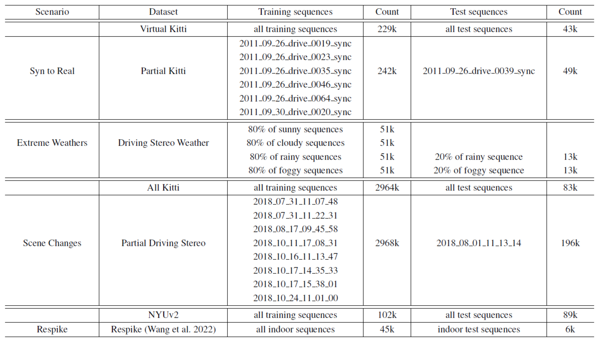

# BiCross - Unsupervised Spike Depth Estimation via Cross-modality Cross-domain Knowledge Transfer

## News

* [2022/10/24] We added more visualization results in another repository: [BiCross-vis](https://github.com/Theia-4869/BiCross-vis).

## Architecture


For more details, please refer to our [paper on Arxiv](https://arxiv.org/abs/2208.12527).


## Result

### Synthetic to Real


### Extreme Weathers


### Scene Changes


## Usage

### Train the model via BiCross
```
python train.py
```

 - Training stages:
    1. Since the pretrained parameters of DPT are trained on the ImageNet, when you train from scratch, please first pretrain the model on the **source RGB** to adapt to the depth estimation task,, changing the `stage` option in the `train_config.json` to `pretrain` and training for about **30** epochs.
    2. After the pretrain stage, set `stage` in `train_config.json` to `crossmodality` and continue training for another **10** epochs from **source RGB** to **source spike**.
    3. Finally, set `stage` in `train_config.json` to `crossdomain` and then continue training for about **20** epochs from **source spike** to **target spike**.

### Test the trained model
```
python test.py
```

### Visualize the results
```
python visualize.py
```


You can modify the configs for different training and testing configurations.

## Datasets

### Detail



### Download

Coming soon (in Google Drive) !

## Demo


